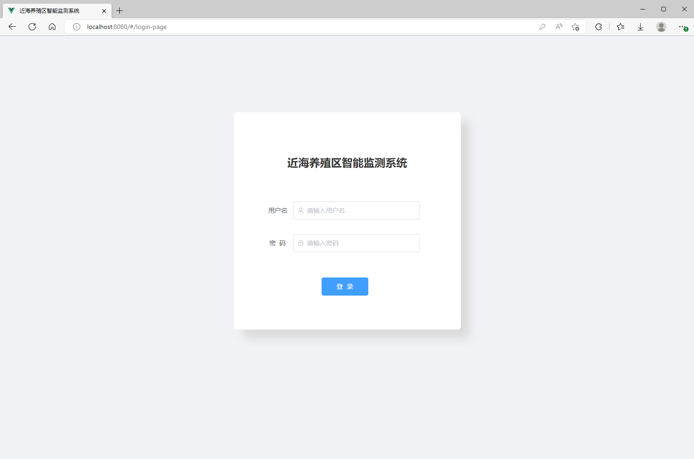
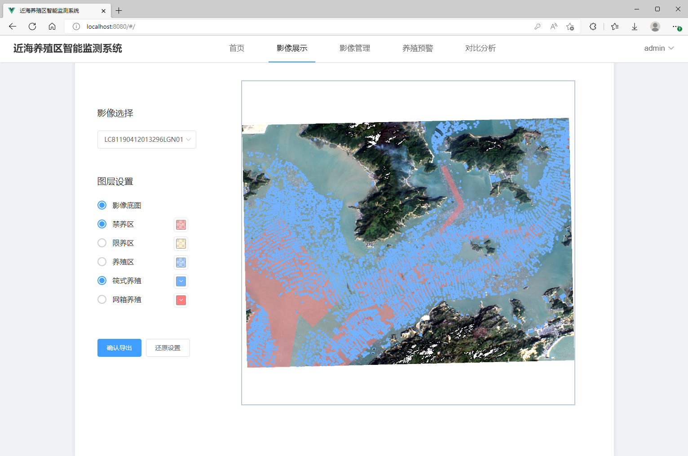
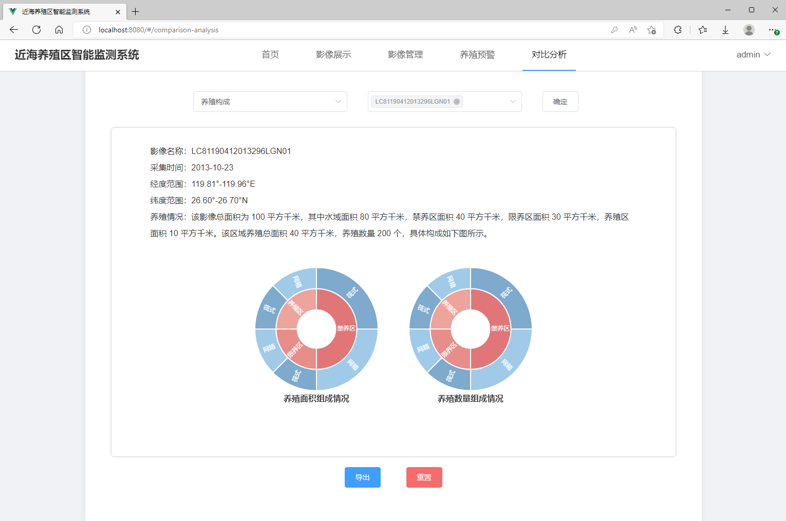
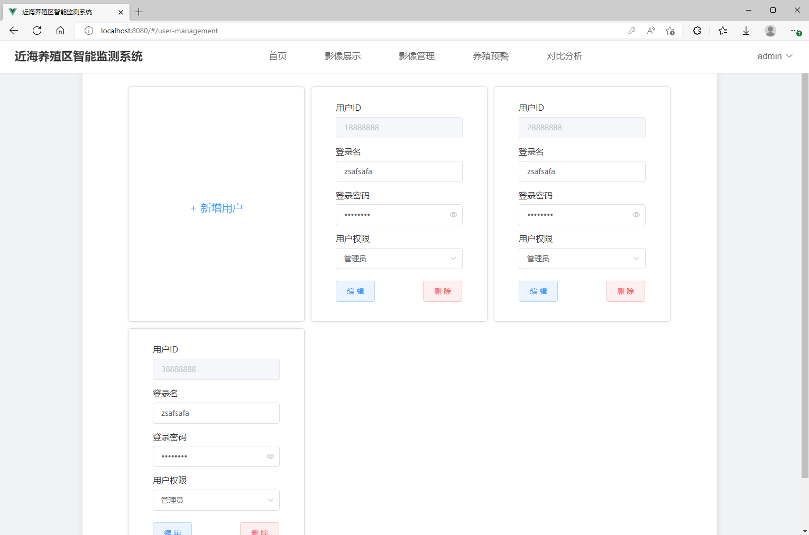

# 近海养殖区智能监测系统-前端部分

## 项目运行
```
git clone
npm install
npm run serve
```

## 简介
提供近海养殖区的自动识别、影像展示、数据管理、分析预警、用户管理等功能

主要用到HTML、CSS、JavaScript、vue、vue-cli、vue-router、Element-UI、Echarts、axios

按功能拆分为八个组件：PageHeader、HomePage、ImageDisplay、ImageManagement、AquacultureWarning、ComparisonAnalysis、UserManagement 、LoginPage

## 部分页面预览






